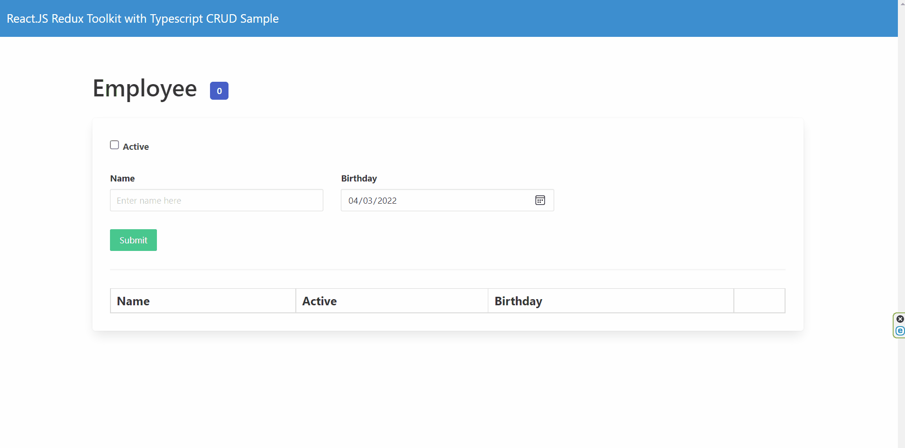

# React.JS Typescript with ReduxToolkit CRUD Sample

## Overview

This repository provides a basic but dynamic demo & reference for React.JS with Redux Toolkit that performs CRUD (Create, Read, Update & Delete) operations. The project is also using typescript as part of the react template.

[Demo](https://reactjs-ts-crud-with-reduxtoolkit.netlify.app/)



(Note: Download Redux Dev Tools chrome extension for better visibility of your store: [Redux DevTools](https://chrome.google.com/webstore/detail/redux-devtools/lmhkpmbekcpmknklioeibfkpmmfibljd?hl=en))

### Redux Toolkit:
- **Simple** - Provides good defaults for store setup out of the box, and includes the most commonly used Redux addons built-in.
- **Opinionated** - 
  Provides good defaults for store setup out of the box, and includes the most commonly used Redux addons built-in.
- **Powerful** - Takes inspiration from libraries like Immer and Autodux to let you write "mutative" immutable update logic, and even create entire "slices" of state automatically.
- **Effective** - Lets you focus on the core logic your app needs, so you can do more work with less code.

You can read more from the official documentation: [https://redux-toolkit.js.org/](https://redux-toolkit.js.org/)

### Getting Started
1. Restore the package by running the `npm i` inside the directory where [package.json](package.json) is stored.
2. Connect to the web api endpoint. You can use the deployed endpoint or use your local. This can be modified inside the [api.ts](./src/api.ts)
3. Run the app using: `npm run start`
4. To build: `npm run build`

### Additional Info
- [store.ts](./src/store.ts) - This is where we configure and register our reducers.
- [index.tsx](./src/index.tsx) - After creating the store file, we configured the index.tsx to use the `<Provider store={store}>`
- [components](./src/components) folder - Where we stored our reusable components like Button, Input & Checkbox.
- [features](./src/features/) folder - Where we add our business modules. In our example, it's the `Employee` folder.
- [employeeSlice.ts](./src/features/Employee/employeeSlice.ts) - This is where we create a slice with its reducers. You can create multiple slices depending on your requirements and features.

```
export const employeeSlice = createSlice({
    name: "employee",
    initialState: {
        list: {
            isLoading: false,
            status: "",
            values: []
        },
        save: {
            isSaving: false,
            isDeleting: false
        }
    },
    reducers: {
        clearSuccessMessage: (state, payload) => {
            // TODO: Update state to clear success message
        }
    },
    extraReducers: {
        [getEmployees.pending.type]: (state, action) => {
            state.list.status = "pending"
            state.list.isLoading = true
        },
        [getEmployees.fulfilled.type]: (state, { payload }) => {
            state.list.status = "success"
            state.list.values = payload
            state.list.isLoading = false
        },
        [getEmployees.rejected.type]: (state, action) => {
            state.list.status = "failed"
            state.list.isLoading = false
        }
    }
    ...
})
```
Here's the brief details for the key declared above.

| Key | Description |
| - | - |
| `name` | Name of the reducer |
| `initialState` | Where we declare the initial state of this slice. |
| `reducers` | We put non-async reducers here. |
| `extraReducers` | For async reducers like calling a web api endpoints or working with external resources. |

### Other Packages Used:
- [Bulma](https://bulma.io/) - User Interface
- [Axios](https://axios-http.com/docs/intro) -  Promise-based HTTP Client for node.js
- [Moment](https://momentjs.com/) - Date formatting
- [React-Toastify](https://github.com/fkhadra/react-toastify#readme) - Toast notification

### Contribute
Feel free to share, or even clone or fork this project:  `https://github.com/deanilvincent/React.JS-ReduxToolkit-Typescript-CRUD-Sample.git`

Contribution & pull request is welcome!

I'll be glad if you give this project a ★ on [Github](https://github.com/deanilvincent/React.JS-ReduxToolkit-Typescript-CRUD-Sample) :))


#### License

This project is licensed under the MIT License - see the  [LICENSE.md](https://github.com/deanilvincent/React.JS-ReduxToolkit-Typescript-CRUD-Sample/blob/main/LICENSE) file for details.
